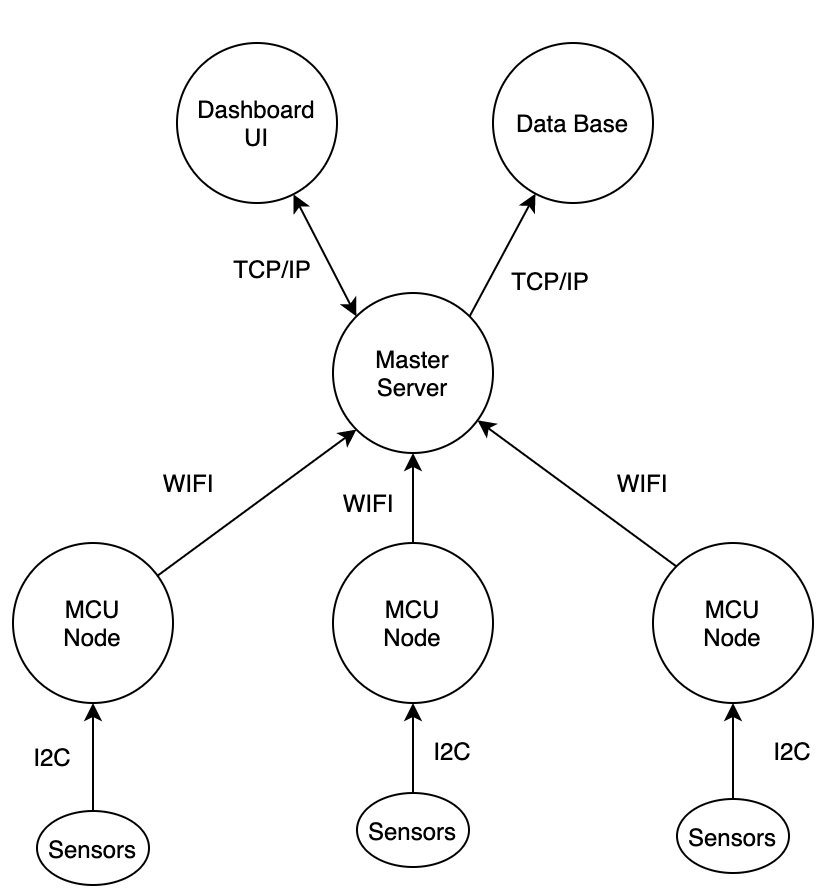
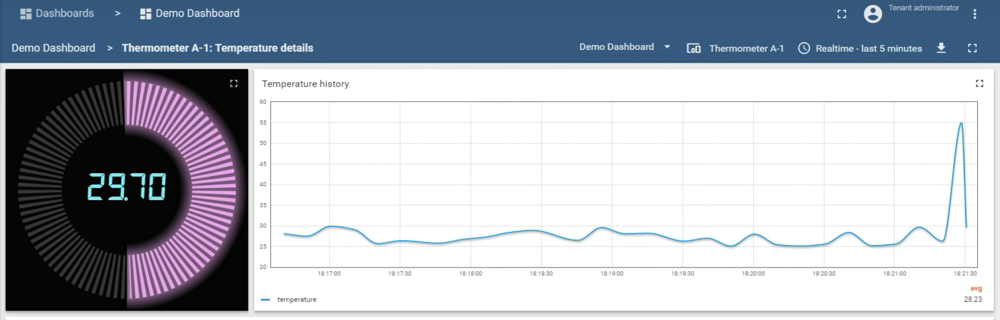
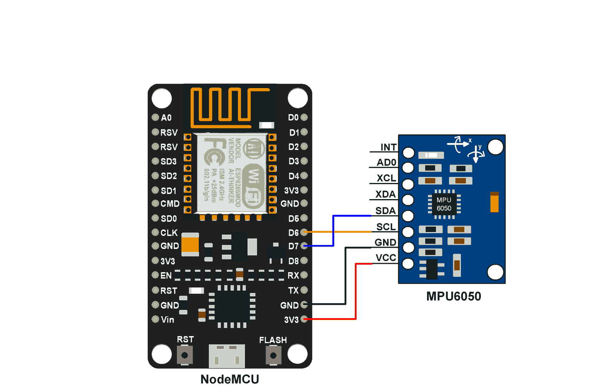

# Overview
This is a IOT node that can monitor the vibration and temperature of an industrial motor. Multiple of these nodes have been deployed in LEARNING FACTORY at McMaster University. Each Node connects automatically to a Raspberry PI master node using WIFI. The data is transmitted using MQTT, each node is a client of the Raspberry PI MQTT server. 
The goal of these nodes is to monitor the motors, and collect data about the motors to preform different thorough researches. 

## Data Flow

 
To communicate between the nodes and the master server the MQTT publish-subscribe network protocol is used to transports messages between nodes and the master.
Once the data is received on the master, the master filters the data, and send it out to the Dashboard for monitoring, and the database to record the data. 
There is a two way communication between the Master Server and the dashboard, because the dashboard has the capability to monitor the data based on a pre-defined. For example if the temperature is above 60 degrees celsius, an event will be triggered and sent back to the Master Server to send an alert to an operator through Email, or SMS using an LTE module. 

## System components

### Sensor: MPU6050
Which has 3-axis Gyroscope, 3-axis Accelerometer, Digital Motion Processor and a Temperature sensor, all in a single IC.
### Microcontroller: NodeMCU Esp8266
Which is a low-cost open-source board that has the ESP8266 WiFi microchip. The board is programmed to connect automatically to a WiFi network, and to send the data through an MQTT topic.
### Local Server: Rasspberry PI
Which is used to filter the data and forward it to the dashboard and the database. The Rasspberry PI is set to be an access WiFi point which allows all MCU Nodes to connect automatically to the PI. On boot, the Rasspberry PI automatically launches the subscribers to the MCU nodes and once the connection is established the data will be filtered and recorded. 

### Front-end server
The UI dashboard can be hosted on any virtual vm that run linux operating system. For security reasons, the dashboard has been deployed on a local server that can be accessed using a VPN. The dashboard is the community version of the ThingsBoard - Open-source IoT Platform. 
 

## Hardware 

### Interfacing Diagram

Software
## NodeMCU with Arduino IDE
To program the NodeMCU with Arduino IDE, refer to [Here](https://create.arduino.cc/projecthub/electropeak/getting-started-w-nodemcu-esp8266-on-arduino-ide-28184f)

### Demo
UPLOAD VIDEO OF A DEMO [TODO]
